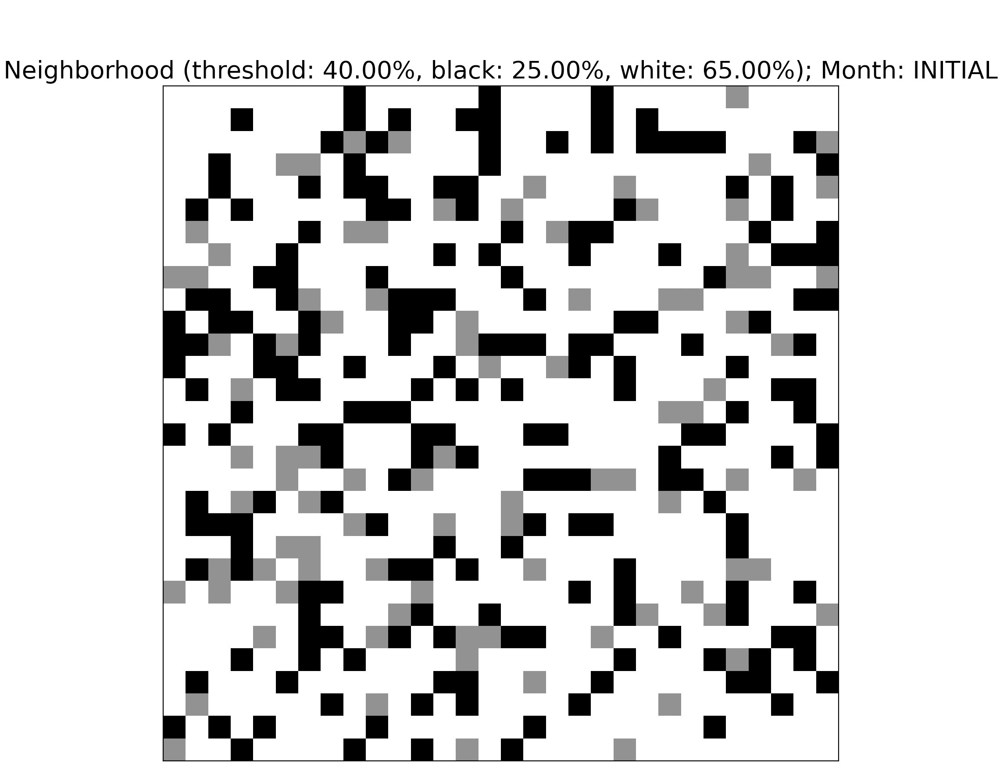
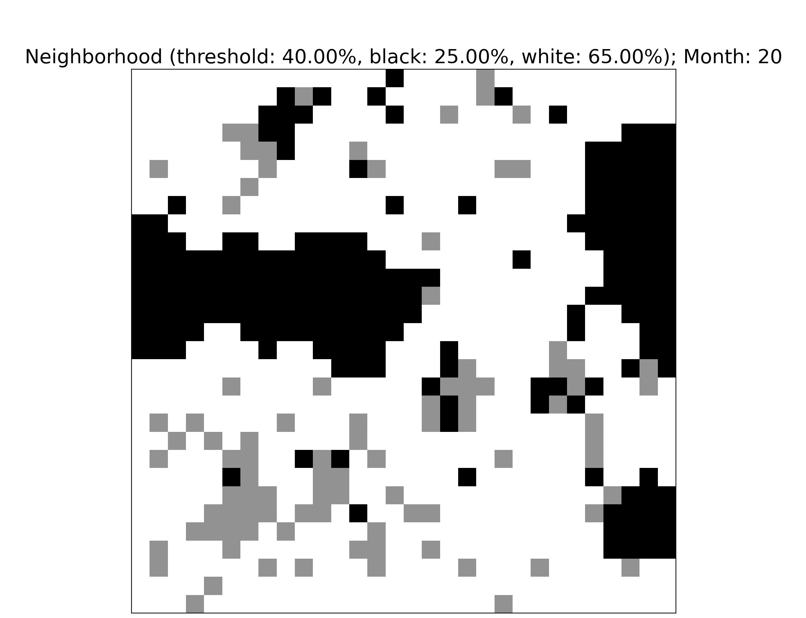

# Schelling Segregation Simulation

[Context on Schelling Segregation](https://en.wikipedia.org/wiki/Schelling%27s_model_of_segregation)

## Experiment
- 30x30 board
- `threshold` = 40%
- black = 25%, white = 65%, empty = 10%
- 20 months/iterations

## Initial State

## End State

## Summary
Schelling Segregation provides an explanation as to why _segregation can occur naturally_ over time, even when agents are fine with the majority of their neighbors being different from them.

It has been found that the _threshold_ can be as low as `1/3` and still lead to segregation.

_threshold_: % of neighbors that are the same as the agent.

### Dynamics
An agent is considered **happy** if the % of its like neighbors is greater than the `threshold` (set by user). If the agent is **unhappy**, it will randomly move to an empty (gray) square in the next iteration (month).

For example, if `threshold=0.4` and a black agent has 4/8 of its neighbors as black, then that agent is considered happy since `0.5 > 0.4`.

### Settings
- Square states: black, white, gray (empty square)
- Board: NxN squares
- Iteration: period of time in which agents can move, in this case months

### Disclaimer
This simulation is basic and is not intended to accurately model the complexity of the real world.
